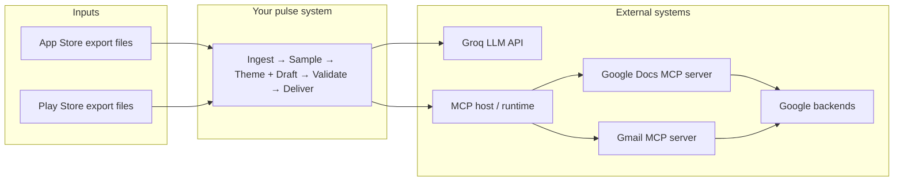
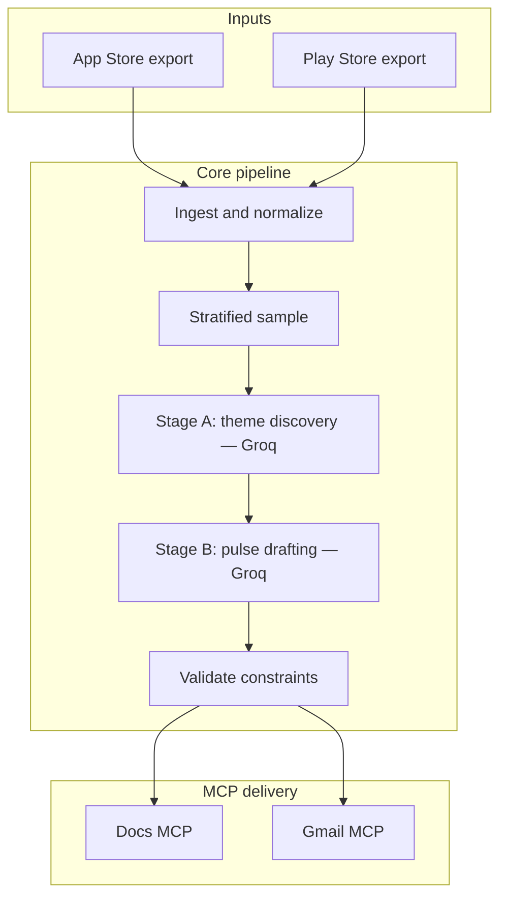
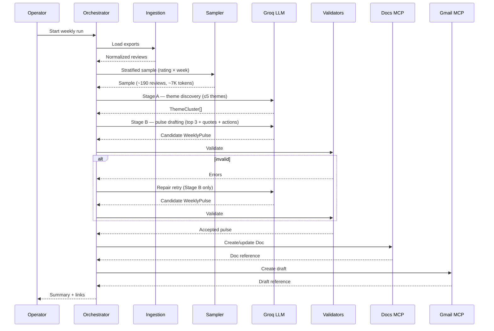
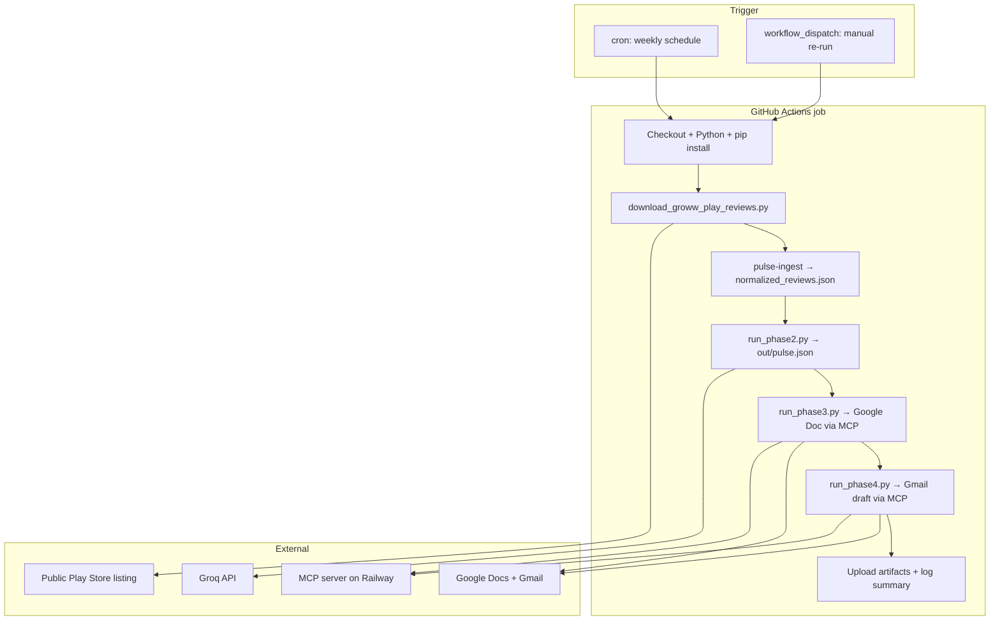

# Architecture: Weekly Review Pulse Agent (MCP)

This document describes how an AI agent (or agent-shaped automation) produces the weekly pulse defined in [problemstatement.md](./problemstatement.md) and delivers it through Google Docs and Gmail using MCP servers, not direct Google API clients in the application layer.

It is written for builders and reviewers: what subsystems exist, how data flows, where trust boundaries sit, and what must remain true for the milestone to be satisfied.

---

## 1. Purpose and scope

### 1.1 What this system does

1. Ingests recent, public mobile-store review exports (App Store and Play Store) for a single product continuity line from Milestone 1.
2. Synthesizes a short weekly narrative: dominant themes, grounded user language, and actionable ideas.
3. Writes a stakeholder-readable artifact in Google Docs via MCP.
4. Creates a Gmail draft (typically to the operator or an alias) via MCP so distribution is one click away without bypassing review.

### 1.2 Explicit non-goals

- No authenticated scraping, headless store browsing, or gray-area automation against storefronts.
- No replacing Google APIs with hand-rolled OAuth clients for Docs/Gmail as the primary integration pattern—MCP servers own that surface ([problemstatement.md](./problemstatement.md)).
- No open-ended “market research agent” beyond the scoped pulse format (caps on themes, quotes, words).

### 1.3 Quality attributes (prioritized)

| Priority | Attribute | Meaning here |
|----------|-----------|--------------|
| 1 | Constraint safety | Word limits, theme caps, and PII rules are enforced before external write operations. |
| 2 | Traceability | Quotes trace back to normalized review text; runs emit enough metadata to reproduce a demo. |
| 3 | Operational simplicity | Few moving parts: ingestion → analysis → validation → MCP deliveries. |
| 4 | Recoverability | Failures at MCP calls do not silently corrupt partial state; errors are visible in logs or operator UI. |

---

## 2. Stakeholders and consumers

| Role | Interest |
|------|----------|
| Product / Growth | Prioritized themes and quotes that justify roadmap bets. |
| Support | Language users actually use; reduces mismatch between marketing and reality. |
| Leadership | One screen of signal per week without raw-review noise. |
| Operator (you) | Repeatable run, clear draft email, Doc link for archiving. |

Architecture does not need separate “dashboards”; Docs + Gmail draft are the consumption surfaces for this milestone.

---

## 3. Context diagram (external actors)



**Interpretation:** Your orchestration talks to Groq for synthesis and to MCP servers for Google-side effects. The MCP host may be the IDE, a CLI, or a job runner—architecture stays valid across those hosts.

---

## 4. High-level pipeline



**Ordering rules:**

- Sampling precedes both LLM stages—never send the full normalized corpus directly.
- Validation gates MCP. If validation fails, the system must not present the pulse as final nor call MCP tools with non-compliant content (unless an explicit, documented “dry-run / debug” mode exists for development only).

---

## 5. Logical components

### 5.1 Review ingestion (non-MCP)

**Responsibility:** Turn heterogeneous export files into a single canonical representation suitable for analysis.

**Inputs:** Files produced by allowed export mechanisms (formats decided in [decision.md](./decision.md)).

**Processing concepts (not implementation):**

- **Parsing:** Tolerate header variants, missing optional fields, and benign encoding issues.
- **Normalization:** Map platform-specific columns into shared semantics (date, rating, title, body, platform).
- **Time windowing:** Retain only reviews whose dates fall in the configured 8–12 week lookback; behavior for timezone-less dates must be consistent.
- **Deduping:** Collapse duplicates that would double-count sentiment (same body + close timestamp + platform, etc.—exact rules in [decision.md](./decision.md)).
- **PII minimization at source:** Remove or never retain reviewer handles when the export includes them; document what the export contained.

**Outputs:** A bounded collection of normalized reviews consumed only by downstream analysis.

**Failure modes:** Unreadable files → actionable error; partial files → ingest what is valid and surface warnings.

---

### 5.2 Analysis and pulse drafting (LLM-centric)

**Responsibility:** Transform normalized reviews into a structured pulse that matches the milestone format.

**LLM provider:** Groq (OpenAI-compatible HTTP API) is used for both stages below. Groq's high tokens/sec keeps the two-call pattern interactive and its 128k-context Llama-class models comfortably fit our sampled inputs. **Pinned model: `llama-3.3-70b-versatile`**; temperature `0.2` for Stage A, `0.5` for Stage B; `response_format: json_object` enforced on both calls. Concrete prompt versions are recorded in [decision.md](./decision.md) (DEC-011).

**Rate limits for `llama-3.3-70b-versatile` (free tier):**

| Limit | Value | Impact |
|-------|-------|--------|
| Requests per minute (RPM) | 30 | 2 calls/run → no issue |
| Requests per day (RPD) | 1,000 | 2 calls/run → 500 runs/day max |
| Tokens per minute (TPM) | 12,000 | Both Stage A + B must fit within one minute window |
| Tokens per day (TPD) | 100,000 | **Binding constraint** — ~9–10 full runs/day |

**Pre-LLM sampling (cost & quality control):** The pipeline applies a two-step reduction before any LLM call:

1. **Pre-sample to 1,000 reviews** — draw proportionally from each rating tier out of the full normalized corpus (currently ~1,880 reviews). This is a hard cap on the working set; same-seed draw is reproducible.
2. **Stratified sample from the 1,000** — bucket by rating tier (negative ≤2★, neutral 3★, positive 4–5★) × ISO week; apply per-tier per-week caps that oversample negative reviews. **Caps (DEC-012):** negative ≤7/week, neutral ≤3/week, positive ≤5/week.

With the Groww dataset this produces approximately **~190 reviews (~6,700 tokens of review text)** for Stage A. Combined with the system prompt (~600 tokens) and Stage B call (~2,600 tokens), the **total per run is ~10,000 tokens** — safely under the 12K TPM limit. TPD allows ~9 full runs per day; retries are budgeted within this (see below). See [decision.md](./decision.md) DEC-012 for full token math.

**Two-stage LLM call sequence (staged pipeline):**

1. **Stage A — Theme discovery (Groq).** Send the stratified sample with `(rating, review_date, review_id, body)` and request a JSON list of ≤5 themes, each with a label, a one-line description, and supporting `review_ids`.
2. **Stage B — Pulse drafting (Groq).** Send the discovered themes plus the supporting evidence and request the final `WeeklyPulse`: top 3 themes, 3 verbatim quotes drawn from the supplied bodies, 3 action ideas, executive framing, total ≤250 words.

A repair retry (bounded) is permitted at Stage B if validation rejects the output (e.g., quote provenance fails, word count exceeds limit).

**Why staged, not monolithic:**

- Theme discovery is a different cognitive task from compressed-narrative writing—separate prompts let each step stay focused.
- Stage B sees only the evidence it needs, keeping prompts small and quote provenance auditable.
- Failures are localized: a bad pulse can be regenerated without re-discovering themes.

---

### 5.3 Validation layer (deterministic)

**Responsibility:** Act as the contract enforcer between creative LLM output and the outside world.

**Checks (conceptual):**

- **Structural:** Correct counts for themes-in-pulse, quotes, actions; cluster count ≤5.
- **Length:** Pulse body ≤ 250 words under an explicit counting policy (headings included or not—must be fixed).
- **Provenance:** Quotes ⊆ normalized corpus (substring or normalized-whitespace match).
- **PII:** Block patterns for emails, phone numbers, obvious @handles if policy forbids them in artifacts.

**Outputs:** Either accept (hand off to MCP) or reject with reasons suitable for automated retry or human intervention.

This layer is what makes the system safe to automate: MCP calls become boring because inputs are already bounded.

---

### 5.4 MCP delivery — Google Docs

**Responsibility:** Persist the pulse where stakeholders habitually read narrative reports.

**Conceptual operations:**

- Create a new document per run/week or update an append-only master log—product choice in [decision.md](./decision.md).
- Apply readable structure: title, date range, sections for themes / evidence / actions.
- Capture returned identifiers (document ID, URL) for correlation with logs and Gmail body.

**Constraints:**

- Only validated pulse content is passed into MCP tool arguments.
- Errors from Google or MCP are surfaced; retries respect idempotency expectations.

---

### 5.5 MCP delivery — Gmail

**Responsibility:** Prepare distribution without forcing immediate send.

**Conceptual operations:**

- Compose subject line reflecting product and week.
- Body contains either the full pulse (if short enough and policy allows) or a link-first email pointing at the Doc plus a terse summary—chosen for readability and duplication risk ([decision.md](./decision.md)).
- Default stance: draft, not send, unless course rules explicitly require otherwise.

---

### 5.6 Orchestration, configuration, and observability

**Orchestration** sequences phases, carries context (run id, week bounds), and decides what happens on validation failure.

**Configuration (non-secret):** lookback weeks, product display name, theme-ranking policy flags, retry counts.

**Secrets:** OAuth tokens and MCP credentials live outside the repo—typically environment variables or secret stores consumed by the MCP host. In scheduled batch mode, these are injected as [GitHub Actions repository secrets](https://docs.github.com/en/actions/security-for-github-actions/security-guides/using-secrets-in-github-actions) (see §10.2).

**Observability (minimum viable):**

- Run identifier, ingest counts, validation outcome, Doc reference, draft reference.
- Model identifier and prompt version if you need reproducibility for grading or audits.
- For scheduled runs: GitHub Actions run logs and uploaded workflow artifacts (`out/pulse.json`, ingest summary).

---

## 6. Trust boundaries and privacy

| Boundary | Inside | Must not leak outward |
|----------|--------|------------------------|
| Exports → Normalization | Raw export blobs | Unredacted reviewer identifiers into logs |
| Normalization → LLM | Review text needed for theming | Fields you promised to strip |
| LLM → Validators | Draft pulse | Treat as untrusted until validated |
| Validators → MCP | Validated pulse | Anything that failed validation |

**Principle:** Assume the LLM can hallucinate structure; validators assume zero trust for counts, quotes, and PII.

---

## 7. Data contracts (logical model)

These names describe interfaces between stages; storage format (JSON rows, in-memory structs) is an implementation detail.

| Artifact | Carries | Consumers |
|----------|---------|-----------|
| `NormalizedReview` | Stable review identity, platform, date, rating, title, body | Analysis, quote provenance checks |
| `ThemeCluster` | Theme id/label, membership references, optional rationale | Pulse drafting, ranking |
| `WeeklyPulse` | Top themes (3), quotes (3), actions (3), optional headline, word count | Validators, Docs, Gmail |
| `DeliveryResult` | Doc locator, Gmail draft locator, timestamps | Logging, demo narrative |

**Versioning:** When pulse shape changes (e.g., adding an “evidence” subsection), bump an internal schema version and record breaking changes in [decision.md](./decision.md).

---

## 8. Sequence: happy path



---

## 9. Failure and retry philosophy

| Failure | Desired behavior |
|---------|------------------|
| Malformed export | Stop early with readable diagnostic; partial ingest only if explicitly supported |
| Groq Stage A invalid JSON | Bounded retries with stricter system prompt; abort if still invalid |
| Groq Stage B fails validation | Bounded retries with corrective instructions (point at offending rule) |
| Docs MCP transient error | Retry with backoff; avoid duplicate docs if “create” is ambiguous—mitigate via naming/idempotency strategy |
| Gmail MCP failure | Preserve Doc outcome; surface partial success |
| Auth expiry (Groq or MCP) | Operator-visible message; no silent fallback to alternate credentials |

---

## 10. Deployment shapes

The logical pipeline (ingest → sample → Groq → validate → MCP) is identical across deployment shapes. What differs is **who triggers the run**, **how fresh review data is obtained**, and **where secrets live**.

### 10.1 Interactive mode

Operator launches the flow in an MCP-capable environment (e.g., IDE agent session or local CLI). Best for demonstrations, prompt tuning, and debugging validation failures.

Typical local sequence:

```bash
python scripts/download_groww_play_reviews.py --weeks 12
pulse-ingest data/groww/groww_play_store_reviews.csv --output data/groww/normalized_reviews.json
python scripts/run_phase2.py
python scripts/run_phase3.py
python scripts/run_phase4.py
```

### 10.2 Batch mode — GitHub Actions scheduler (recommended)

For unattended weekly delivery, **GitHub Actions** is the preferred scheduler. Each workflow run:

1. **Fetches the latest public review data** — no stale CSV checked into the repo.
2. **Executes the same phase scripts** as interactive mode.
3. **Delivers via the hosted MCP server** (HTTP client in `run_phase3.py` / `run_phase4.py`).
4. **Leaves an audit trail** in Actions logs and optional artifacts.

This satisfies DEC-002's requirement that imports happen outside ad-hoc manual steps while keeping the pipeline reproducible.

#### Why GitHub Actions

| Concern | How Actions addresses it |
|---------|--------------------------|
| Weekly cadence | `schedule` trigger with cron (e.g. Monday 06:00 UTC) |
| Fresh data every run | `download_groww_play_reviews.py` runs first; `data/` stays gitignored |
| Secrets | Repository secrets → job `env` (never committed) |
| Operator visibility | Run summary, logs, and `out/pulse.json` artifact |
| Cost | Public repos: generous free minutes; single weekly job is negligible |

#### Scheduled workflow (conceptual)



#### Workflow file (`.github/workflows/weekly-pulse.yml`)

The workflow lives in-repo but is **not** part of the core pipeline logic—it is deployment glue. A minimal shape:

```yaml
name: Weekly Review Pulse

on:
  schedule:
    # Every Monday 06:00 UTC
    - cron: "0 6 * * 1"
  workflow_dispatch: {}

jobs:
  pulse:
    runs-on: ubuntu-latest
    steps:
      - uses: actions/checkout@v4

      - uses: actions/setup-python@v5
        with:
          python-version: "3.12"

      - name: Install dependencies
        run: pip install -e ".[dev]"

      - name: Download latest Play Store reviews
        run: python scripts/download_groww_play_reviews.py --weeks 12

      - name: Ingest and normalize
        run: >
          pulse-ingest data/groww/groww_play_store_reviews.csv
          --output data/groww/normalized_reviews.json

      - name: Analyze and draft pulse
        env:
          GROQ_API_KEY: ${{ secrets.GROQ_API_KEY }}
        run: python scripts/run_phase2.py

      - name: Publish to Google Docs
        env:
          GOOGLE_DOC_ID: ${{ secrets.GOOGLE_DOC_ID }}
          MCP_SERVER_URL: ${{ secrets.MCP_SERVER_URL }}
        run: python scripts/run_phase3.py

      - name: Create Gmail draft
        env:
          DRAFT_RECIPIENT: ${{ secrets.DRAFT_RECIPIENT }}
          MCP_SERVER_URL: ${{ secrets.MCP_SERVER_URL }}
        run: python scripts/run_phase4.py

      - name: Upload pulse artifact
        uses: actions/upload-artifact@v4
        with:
          name: weekly-pulse-${{ github.run_id }}
          path: out/pulse.json
          if-no-files-found: error
```

#### Required repository secrets

| Secret | Used by | Notes |
|--------|---------|-------|
| `GROQ_API_KEY` | `run_phase2.py` | Groq console key |
| `GOOGLE_DOC_ID` | `run_phase3.py` | Target Doc from URL |
| `DRAFT_RECIPIENT` | `run_phase4.py` | Draft recipient (DEC-005) |
| `MCP_SERVER_URL` | `run_phase3.py`, `run_phase4.py` | Hosted MCP base URL; omit if default Railway deploy is used |

Local development continues to use `.env` (gitignored); CI uses the same variable names via GitHub Secrets.

#### Operational notes

- **Data freshness:** The download script paginates newest-first and stops at the configured lookback window (default 12 weeks). Every scheduled run replaces the on-runner CSV and normalized JSON—there is no dependency on committed export files.
- **MCP auth:** The MCP server must accept requests from GitHub-hosted runners without interactive OAuth. Auth is owned by the deployed MCP instance (Railway), not the workflow file.
- **Partial failure:** If Phase 3 succeeds but Phase 4 fails, the Doc is already updated; the workflow should fail visibly so the operator can send manually. Aligns with §9 Gmail MCP failure behavior.
- **Manual re-run:** `workflow_dispatch` lets an operator trigger the same pipeline on demand (e.g. after a prompt change) without waiting for cron.
- **Rate limits:** Groq free-tier TPD (~9–10 full runs/day) is ample for one weekly job plus occasional manual runs (see §5.2).

#### Alternatives considered

| Option | Why not primary |
|--------|-----------------|
| OS cron on a laptop | Machine must stay on; secrets on disk; no shared audit log |
| Cloud Functions / Lambda | Extra infra; same steps still need packaging and secret wiring |
| Committed CSV in repo | Stale reviews; violates spirit of DEC-002 automation |

GitHub Actions keeps scheduler, fresh-data fetch, and delivery orchestration in one place the course repo already uses.

---

## 11. Related documents

| Document | Role |
|----------|------|
| [problemstatement.md](./problemstatement.md) | Requirements and constraints |
| [implementationplan.md](./implementationplan.md) | Phased delivery detail |
| [decision.md](./decision.md) | Accepted architectural and product decisions |
| [phases/phase-NN/eval.md](./phases/phase-1/eval.md) | Per-phase testing and exit criteria |
